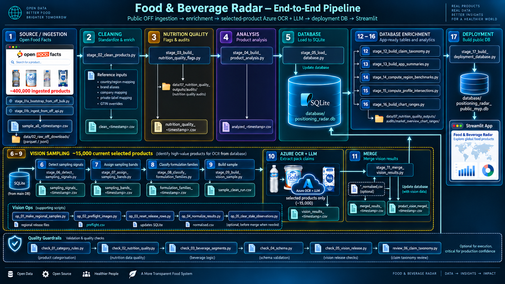

# Food & Beverage Positioning Radar

**A beta open-data market-intelligence board for exploring how packaged foods
and beverages position themselves through nutrition, ingredients, processing,
brand / company mapping, and front-of-pack communication.**

[](https://opendatacommons.org/licenses/odbl/)
[](https://www.apache.org/licenses/LICENSE-2.0)
[](https://www.python.org/)
[](https://world.openfoodfacts.org/)

> **Beta MVP launch build.** This project is built on Open Food Facts records.
> It includes governed cleaning, nutrition-quality, category, brand, company,
> and front-pack evidence layers. Open Food Facts remains crowdsourced, so some
> product records can still be incomplete, inconsistent, or unresolved.

## What This Is

Food & Beverage Positioning Radar is a neutral analytical board for exploring
packaged food and beverage products. It helps users inspect what products
contain, how they are classified, which consumer-facing brands and company
routes they map to, and what they communicate on pack where image evidence is
available.

The central question is:

**How do packaged foods and beverages position themselves through claims,
ingredients, nutrition, processing, and design?**

The tool does not judge products, assess legal compliance, recommend purchases,
rank brands, or estimate market share. It organizes open product data so users
can inspect patterns and make their own interpretation.

## Current Scope

The beta MVP focuses on observed Open Food Facts records in:

- France
- UK & Ireland
- US & Canada

Current Streamlit categories:

- Snacks
- Cereals
- Dairy
- Beverages

Counts are observed Open Food Facts records after project cleaning rules. They
are not sales volumes, launch counts, household penetration, retail
distribution, shelf share, or consumer-demand estimates.

## What The App Shows

**Market Overview** shows high-level patterns for a selected market-category
base. It supports category reports, brand comparison, company/brand drill-down,
product-level nutrition maps, and a beverage view segment filter that separates
ready-to-drink beverages from beverage preparations / alcohol and unknown
beverage records.

**Product Explorer** lets users search individual products, filter by category,
market, brand, company, nutrition status, NOVA, Nutri-Score, and detected
positioning signals, then inspect product-level evidence.

**Methodology** and **About** explain how to read the data, what the app does
not claim, and where Open Food Facts source limitations matter.

## Governance Status

The major launch governance layers are documented for the current MVP scope;
reviewed mapping and category scopes are locked where stated:

- category cleanup is locked for France, UK/Ireland, and US/Canada snacks and
  cereals, with additional GTIN-level corrections from the September 2026
  mapping/orphan audits;
- retailer/private-label mapping is complete and locked;
- the nine priority manufacturer portfolios are locked after product-level
  audit and regression validation;
- regional-category orphan-brand review is complete across France, UK/Ireland,
  and US/Canada;
- nutrition-quality and outlier governance is locked for Product Explorer and
  Market Overview: Product Explorer hard gates define the usable population,
  all passing products are used in Market Overview calculations, and
  chart-range controls affect visualization only;
- beverage segmentation is an MVP chart-readability layer, not a final beverage
  taxonomy.

The regional orphan threshold was:

```
normalized brand assigned to Other / not mapped to a company
AND at least 100 products in one specific region x category bucket
```

France and US/Canada had qualifying candidates and were audited, implemented,
and validated. UK/Ireland had no qualifying orphan candidates at that threshold.
The final residual review confirms that no normalized brand with at least 100
products in a single launch region-category remains under
`Other / not mapped to a company` without reviewed resolution.

Individual products can still remain under `Other / not mapped to a company`
when ownership is genuinely ambiguous. The project deliberately prefers a false
negative to a false-positive owner assignment.

## Methodology In Brief

The app separates two evidence layers:

**Structured product evidence** comes from Open Food Facts records plus governed
project-derived metadata. It includes composition data such as nutrition values,
ingredients, Nutri-Score, and NOVA group, alongside category scope, market tags,
brand normalization, and company / owner routing.

**Pack-communication evidence** comes from OCR and LLM analysis of selected
front-pack images. It is shown at product level where available and should not
be read as representative market-level claim prevalence.

Core data principles:

- raw source values are preserved where the pipeline has provenance fields;
- missing values are not treated as zero;
- category, brand, company, and nutrition fields are governed derived layers;
- Product Explorer can show imperfect but useful records;
- all products that pass Product Explorer hard validity gates are used in
  Market Overview calculations;
- Market Overview charts use the same valid population, with precomputed
  chart-range controls for visualization readability;
- exact reviewed GTIN overrides outrank broad brand/company/category rules.

## Known Beta Limitations

- Open Food Facts is crowdsourced; records can be incomplete, duplicated,
  outdated, or inconsistent.
- Product counts are observed records, not market size.
- Country tags indicate where a product was observed in Open Food Facts, not
  guaranteed distribution.
- Brand/company ownership can be market-specific, product-form-specific,
  license-specific, or recently changed.
- Company filters are directional navigation aids, not legal ownership
  guarantees.
- Some products remain under `Other / not mapped to a company` after review.
- Beverage segmentation is rule-based and not a complete commercial beverage
  taxonomy.
- Front-pack claim extraction covers selected image-analyzed products only.
- Cold starts and broad filter changes can be slower on the public beta
  deployment.

## How To Run

```bash
git clone https://github.com/julialenc/food-beverage-positioning-radar.git
cd food-beverage-positioning-radar
python -m venv .venv
.venv\Scripts\activate
pip install -r requirements.txt
streamlit run app.py
```

Azure Vision and Azure OpenAI credentials are required only for the vision
pipeline. The Streamlit app can run from the prepared local database or from the
compressed public MVP database artifact included for deployment.

## Repository Layout

```
app.py                  Streamlit entry point
pages/                  Streamlit pages
shared/                 Shared UI, labels, beverage segments, and DB helpers
pipeline/               Production stages, validation checks, governance tools, prompts, and exports
data/                   Committed reference inputs plus ignored generated output homes
database/               Schema reference, local build DB, and compressed public MVP DB artifact
docs/                   Product governance, pack-image analysis, and project reference documents
```

Generated local workspaces are kept as empty committed folders with `.gitkeep`
placeholders:

```
data/02_raw_off_downloads/            Cached OFF/API inputs when regenerated
data/03_pipeline_intermediates/       Core OFF pipeline CSV outputs
data/04_vision_sampling/              Pre-extraction sampling outputs
data/05_vision_release/               Vision release samples, results, merge files, and QA outputs
data/06_brand_governance_outputs/     Category and brand/company governance review exports
data/07_nutrition_quality_outputs/    Nutrition-quality audit and review outputs
```

Generated CSVs, raw Open Food Facts downloads, local audit exports, and the full
local SQLite build database are not part of the public data surface. They can be
regenerated when needed and should not be committed unless a file is explicitly
promoted to production reference status.

## Production Reference Files

The production reference layer is under `data/01_reference_inputs/`:

- `01_country_region_mapping.csv` - OFF country to project region-code mapping;
- `02_brand_alias_mapping.csv` - reviewed brand-string aliases;
- `03_company_brand_mapping.csv` - reusable brand-to-company routing rules;
- `04_private_label_brand_mapping.csv` - reviewed retailer/private-label brand
  architecture;
- `05_reviewed_product_mapping_overrides.csv` - exact GTIN-level reviewed brand,
  company, category, and `OUT_OF_SCOPE` overrides;
- `06_top_company_brand_portfolio_matrix.csv` - priority manufacturer portfolio and
  discovery reference;
- `README.md` - reference-file descriptions and provenance notes.

These files are project-maintained derived inputs used by the cleaning and
governance layers. Their resolved outputs are subsequently loaded into SQLite
and consumed by the Streamlit app.

## Pipeline Overview



*End-to-end architecture: modular data processing, selected-product OCR/LLM enrichment, and independent quality guardrails.*

The standard local build path is:

```
01A. pipeline/stages/stage_01a_bootstrap_from_off_bulk.py
     or
01B. pipeline/stages/stage_01b_ingest_from_off_api.py
02.  pipeline/stages/stage_02_clean_products.py
03.  pipeline/stages/stage_03_build_nutrition_quality_flags.py
04.  pipeline/stages/stage_04_build_product_analysis.py
05.  pipeline/stages/stage_05_load_database.py
06.  pipeline/stages/stage_06_detect_sampling_signals.py
07.  pipeline/stages/stage_07_assign_sampling_bands.py
08.  pipeline/stages/stage_08_classify_formulation_families.py
09.  pipeline/stages/stage_09_build_vision_sample.py
10.  pipeline/stages/stage_10_extract_pack_claims.py  [paid/manual vision stage]
11.  pipeline/stages/stage_11_merge_vision_results.py
12.  pipeline/stages/stage_12_build_claim_taxonomy.py
13.  pipeline/stages/stage_13_build_app_summaries.py
14.  pipeline/stages/stage_14_compute_region_benchmarks.py
15.  pipeline/stages/stage_15_compute_profile_intersections.py
16.  pipeline/stages/stage_16_build_chart_ranges.py
17.  pipeline/stages/stage_17_build_deployment_database.py
```

Some scripts are maintenance or review utilities rather than automatic pipeline
steps. Use them deliberately when refreshing mappings, category rules,
nutrition governance, or the vision sample. Stages 06-10 form the vision
sampling/extraction branch and are run when that branch is intentionally
refreshed. Stage 10 is the paid Azure OCR + LLM step.

Vision Ops can also prepare regional release files, preflight image URLs, and
reset selected database rows before extraction.
After extraction, release files may be normalized or retired with
`pipeline/vision_ops/op_04_normalize_results.py` and
`pipeline/vision_ops/op_05_clear_stale_observations.py` before Stage 11 merges
the current release into the database.

Independent validation checks sit alongside the pipeline as quality guardrails:
they are not data dependencies, but they are important for production
confidence.

Navigation files:

- `pipeline/README_NAVIGATING_PIPELINE.md` - one-line map of every pipeline script;
- `data/README_NAVIGATING_DATA.md` - data-folder tree and generated-output contract.

## Documentation

- `docs/03_PROJECT_REFERENCE/02_METHODOLOGY.md` - metric definitions, evidence layers, and
  interpretation rules
- `docs/03_PROJECT_REFERENCE/03_LIMITATIONS.md` - source-data, coverage, and methodology limitations
- `docs/01_PRODUCT_DATA_GOVERNANCE/01_CATEGORY_SCOPE_AND_CLEANUP.md` - category cleanup and routing governance
- `docs/01_PRODUCT_DATA_GOVERNANCE/02_BRAND_COMPANY_MAPPING.md` - brand normalization and company mapping
  governance
- `docs/01_PRODUCT_DATA_GOVERNANCE/03_NUTRITION_QUALITY_GOVERNANCE.md` - nutrition-quality and outlier
  treatment rules
- `docs/03_PROJECT_REFERENCE/04_DATA_DICTIONARY.md` - database/output field definitions
- `docs/02_PACK_IMAGE_ANALYSIS/01_FRONT_PACK_CLAIM_EXTRACTION.md` - OCR/LLM front-pack claim extraction methodology
- `docs/02_PACK_IMAGE_ANALYSIS/02_CLAIM_TAXONOMY_LABELS.md` - claim taxonomy label definitions
- `docs/03_PROJECT_REFERENCE/01_ADR.md` - architecture decision records
- `data/01_reference_inputs/README.md` - reference mapping files and provenance notes
- `pipeline/README_NAVIGATING_PIPELINE.md` - pipeline folder and script map
- `data/README_NAVIGATING_DATA.md` - data folder and output-home map

## Data Source, License, And Attribution

Product data is sourced from [Open Food Facts](https://world.openfoodfacts.org/),
licensed under the **Open Database License (ODbL)**.

Repository code and original project documentation are licensed under the
**Apache License, Version 2.0**. See `LICENSE` and `NOTICE`.

If you reuse or redistribute this project, retain the Apache 2.0 license and
notice files and credit:

```
Food & Beverage Positioning Radar by Julia Lenc
```

Data attribution:

```
Data from Open Food Facts - https://world.openfoodfacts.org
```

See `CITATION.md` for citation guidance.

---

*Data from Open Food Facts - openfoodfacts.org - ODbL license*  
*Project code and documentation licensed under Apache 2.0*
